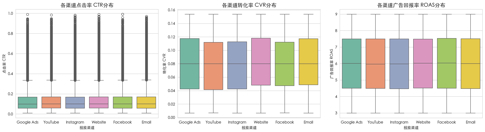
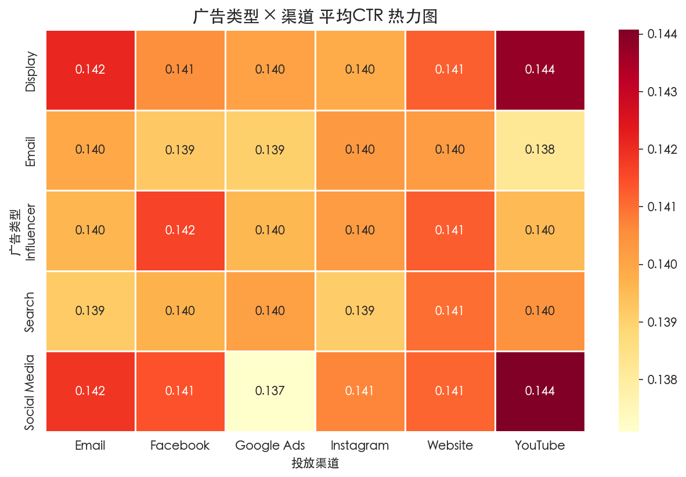
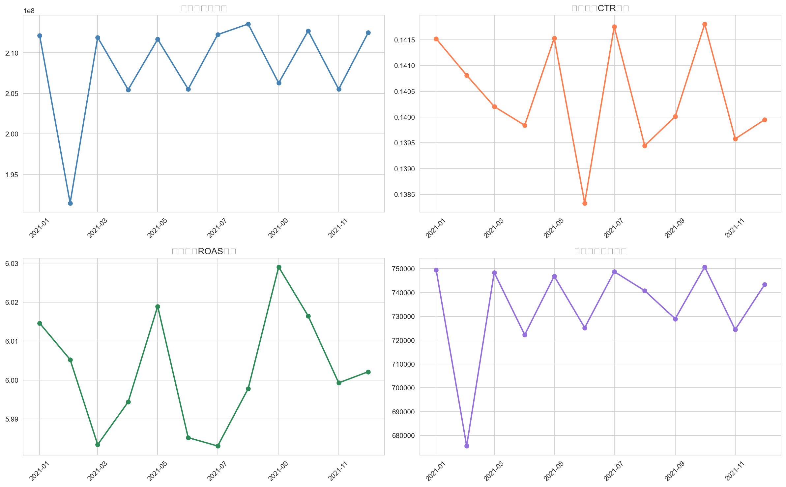

# 多渠道广告投放效果分析 Dashboard

模拟新能源汽车品牌多渠道广告投放场景，对20万条投放数据进行清洗、分析与可视化，产出交互式Dashboard和数据洞察报告。

## 项目背景

针对汽车行业广告投放场景，基于6大投放渠道（Google Ads、YouTube、Instagram、Facebook、Website、Email）和5种广告类型（Display、Email、Influencer、Search、Social Media）的投放数据，分析各渠道效果差异、转化效率和预算分配合理性，给出优化建议。

## 使用工具

- **Python 3.9**：数据清洗与探索性分析（Pandas、NumPy、Matplotlib、Seaborn）
- **Tableau Public**：交互式Dashboard搭建与发布
- **Jupyter Notebook**：分析流程文档化

## 数据来源

[Kaggle - Marketing Campaign Performance Dataset](https://www.kaggle.com/datasets/manishabhatt22/marketing-campaign-performance-dataset)

- 200,000 条投放记录
- 时间范围：2021-01-01 ~ 2021-12-31
- 16 个原始字段，经清洗后扩展至 26 个字段

## 项目结构

```
├── data_prep.ipynb                  # 数据清洗 + 特征工程 + EDA
├── cleaned_campaign_data_sample.csv # 清洗后数据样本（10K行）
├── insight_report.md                # 数据洞察分析报告
├── tableau_guide.md                 # Tableau Dashboard设计方案与操作指引
├── eda_*.png                        # EDA可视化图表
└── README.md
```

## 主要分析结论

1. **YouTube + Social Media 组合 CTR 最优**（14.41%），高于全渠道均值 14.04%
2. **Website 渠道 CPC 最低**（$31.78），同等预算可获取更多点击
3. **Social Media 广告类型 CPA 最低**（$634），转化成本控制最优
4. **Men 25-34 受众 ROAS 最高**（6.02），为核心高价值人群
5. 各渠道花费分配均衡（16.4%~16.8%），月度趋势平稳

## Dashboard 预览

<!-- Tableau Public 链接（发布后替换） -->
> Dashboard链接：*待发布到 Tableau Public 后补充*

## EDA 可视化示例

| 图表 | 说明 |
|------|------|
|  | 各渠道 CTR / CVR / ROAS 分布对比 |
|  | 广告类型 × 渠道 CTR 热力图 |
|  | 月度花费、CTR、ROAS、转化量趋势 |
